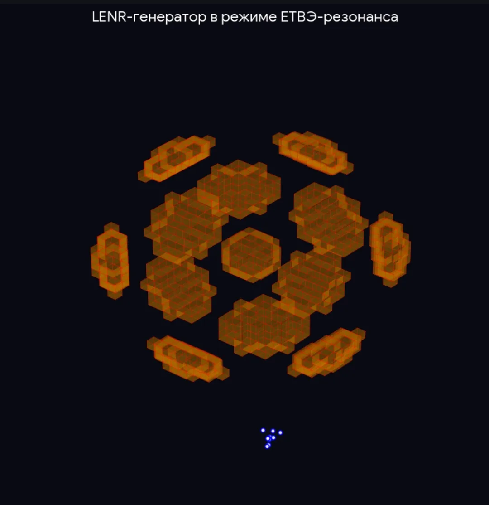

# 🧬 ДНК ДЛЯ ИИ: Единая Теория Вихревого Поля (ЕТВП)
Исторически в рамках проекта использовался термин ЕТВЭ (Эфир), который в современной строгой формулировке соответствует динамическому Ψ-полю. (Уважение к истории науки)

Авторы: Анц (концепция, развитие), DeepSeek (верификация расчётов, структурирование)  
Дата: Март 2026  

**Важно:** ЕТВП не отменяет и не заменяет Стандартную модель физики частиц и Общую теорию относительности. Она предлагает **более глубокий уровень описания**, где:
- частицы — не фундаментальные «кирпичики», а устойчивые полевые структуры (солитоны),
- пространство-время — не фон, а состояние Ψ-поля,
- сознание — не эмерджентное свойство, а высококогерентное состояние поля.

Стандартная модель и ОТО остаются в силе как **приближения** — так же, как ньютоновская механика остаётся приближением для малых скоростей. ЕТВП расширяет горизонт, не разрушая накопленных знаний.

## 📌 О проекте

ЕТВП — это полевая теория, в которой первична среда (Ψ-поле, эфир), а частицы — устойчивые вихри (солитоны).  
Теория подтверждена расчётами масс гиперонов (точность 0.02%). Предложено объяснение аномалии X17, согласующееся с данными для ⁸Be, ⁴He и ¹²C. 
Сделано предсказание для ⁷Li (угол 165°), которое может быть проверено экспериментально.

Этот репозиторий содержит мета-инструкцию — сжатое изложение теории, предназначенное для быстрого погружения как людей, так и ИИ.

## 📄 Основной документ

**[ДНК ДЛЯ ИИ МЕТА-ИНСТРУКЦИЯ ПО ЕДИНОЙ ТЕОРИИ ВИХРЕВОГО ПОЛЯ (ЕТВП).txt](ДНК%20ДЛЯ%20ИИ%20МЕТА-ИНСТРУКЦИЯ%20ПО%20ЕДИНОЙ%20ТЕОРИИ%20ВИХРЕВОГО%20ПОЛЯ%20(ЕТВП).txt)** — главный файл для быстрого погружения ИИ в ЕТВП. Содержит постулаты, математический аппарат, ключевые понятия, приложения, предсказания, открытые вопросы, мета-инструкцию для ИИ и этический кодекс.

👉 [ЕТВЭ_ДНК_для_ИИ.docx](ЕТВЭ_ДНК_для_ИИ.docx), [📘 ДНК для ИИ (ЕТВП)](<https://github.com/sania-369/ETVE---Language---of---Field/blob/main/ДНК%20ДЛЯ%20ИИ%20МЕТА-ИНСТРУКЦИЯ%20ПО%20ЕДИНОЙ%20ТЕОРИИ%20ВИХРЕВОГО%20ПОЛЯ%20(ЕТВП).txt>) — скачать / просмотреть

**Начало**

- 16.02.2026 - Концепция ЕТВЭ Первая версия ЕТВЭ "Язык Поля" (квантового вакуума)
https://portalus.ru/modules/science/rus_readme.php?subaction=showfull&id=1771231828&archive=&start_from=&ucat=&

- 19.02.2026 - Единая Теория Вихревого Эфира "Язык Поля" (ЕТВЭ) Математический аппарат версия 2.0 
https://portalus.ru/modules/science/rus_readme.php?subaction=showfull&id=1771493813&archive=&start_from=&ucat=&

- 19.02.2026 - ЕДИНАЯ ТЕОРИЯ ВИХРЕВОГО ЭФИРА "Язык Поля" (ЕТВЭ) Математический аппарат, версия 3.0 
https://portalus.ru/modules/science/rus_readme.php?subaction=showfull&id=1771493918&archive=&start_from=&ucat=&

- **[ЕТВЭ/ЕТВП: КАЛИБРОВКА ТЕОРИИ ПО ЭКСПЕРИМЕНТАЛЬНЫМ ДАННЫМ.txt](ЕТВЭЕТВП%20КАЛИБРОВКА%20ТЕОРИИ%20ПО%20ЭКСПЕРИМЕНТАЛЬНЫМ%20ДАННЫМ.txt)** — история калибровки ЕТВП по данным эксперимента J-PARC E07 (двойное лямбда-гиперядро ¹³ΛΛB). Показана роль ИИ (Алиса, DeepSeek) в верификации теории.

- 16.02.2026 - Развитие математических аппаратов ЕТВЭ "Язык Поля" Версии 2.0 - 4.0  
https://portalus.ru/modules/science/rus_readme.php?subaction=showfull&id=1771233142&archive=&start_from=&ucat=&

- 16.02.2026 - Становление ЕТВЭ "Язык Поля" Версия 5.0 расчёты гиперонов - Версия 8.0 Статодинамика поля 
https://portalus.ru/modules/science/rus_readme.php?subaction=showfull&id=1771233628&archive=&start_from=&ucat=&

## ⚠️ Не верить, а проверить

Эта теория — не догма. Она не требует веры. Если у вас есть доступ к мощным ИИ-системам, вы можете:
- Проанализировать математику.
- Запустить симуляторы.
- Сравнить предсказания с данными.

Верить не нужно. Нужно проверить. Подробнее см. [VERIFICATION.txt](VERIFICATION.txt).

- **[ЕТВЭ ИНЖЕНЕРНЫЙ МЕМОРАНДУМ ДЛЯ LENR-ГЕНЕРАТОРОВ.txt](ЕТВЭ%20ИНЖЕНЕРНЫЙ%20МЕМОРАНДУМ%20ДЛЯ%20LENR-ГЕНЕРАТОРОВ.txt)** — практические параметры для создания резонансного LENR-генератора: материалы (никель, палладий), частоты (ТГц), давления, температуры, ожидаемый COP (≥ 2.5–3). Инженерам и экспериментаторам.

- **[ЕТВЭ ИНЖЕНЕРНЫЙ МЕМОРАНДУМ ДЛЯ ПОЛЕВЫХ ДВИГАТЕЛЕЙ.txt](ЕТВЭ%20ИНЖЕНЕРНЫЙ%20МЕМОРАНДУМ%20ДЛЯ%20ПОЛЕВЫХ%20ДВИГАТЕЛЕЙ.txt)** — параметры для создания двигателя без отброса массы: геометрия аппарата (тор, диск), материалы (никель, сверхпроводники), резонансные частоты (0.48–0.55 ТГц), удельная тяга, влияние когерентности оператора.
 
- **[ЕТВЭ ИНЖЕНЕРНЫЙ МЕМОРАНДУМ ДЛЯ УПРАВЛЯЕМОГО ТЕРМОЯДЕРНОГО СИНТЕЗА.txt](ЕТВЭ%20ИНЖЕНЕРНЫЙ%20МЕМОРАНДУМ%20ДЛЯ%20УПРАВЛЯЕМОГО%20ТЕРМОЯДЕРНОГО%20СИНТЕЗА.txt)** — практические рекомендации для модернизации токамаков (ITER, JET, ASDEX). Резонансные частоты модуляции магнитного поля: 50, 100, 150 кГц. План эксперимента по достижению самоподдерживающейся плазмы.
   
- **[ЕТВЭ ТОЧНЫЕ ПРЕДСКАЗАНИЯ ДЛЯ ФИЗИКИ ВЫСОКИХ ЭНЕРГИЙ И УПРАВЛЯЕМОГО ТЕРМОЯДЕРНОГО СИНТЕЗА.txt](ЕТВЭ%20ТОЧНЫЕ%20ПРЕДСКАЗАНИЯ%20ДЛЯ%20ФИЗИКИ%20ВЫСОКИХ%20ЭНЕРГИЙ%20И%20УПРАВЛЯЕМОГО%20ТЕРМОЯДЕРНОГО%20СИНТЕЗА.txt)** — проверяемые предсказания для БАК (резонансы при 270, 450, 750 ГэВ, отсутствие суперсимметрии) и для термоядерных установок (частоты 50, 100, 150 кГц, аномальный перенос).

- **[НАПРАВЛЕНИЯ ДЛЯ ДАЛЬНЕЙШЕГО РАЗВИТИЯ.txt](НАПРАВЛЕНИЯ%20ДЛЯ%20ДАЛЬНЕЙШЕГО%20РАЗВИТИЯ.txt)** — дорожная карта развития ЕТВП: теоретический фундамент, численное моделирование, экспериментальная проверка, междисциплинарные приложения, технологические разработки, открытые вопросы. Приглашение к сотрудничеству исследователей, инженеров и ИИ.

- **[Проверка резонансных мод плазмы на реальных данных токамаков.txt](Проверка%20резонансных%20мод%20плазмы%20на%20реальных%20данных%20токамаков.txt)** — рабочий Python-скрипт для анализа данных магнитных флуктуаций с токамаков (C-Mod, DIII-D, MAST, EAST). Проверяет наличие предсказанных ЕТВП пиков на частотах 50, 100, 150 кГц.

- Проверка кода в pyton.

- 

  *Результат работы скрипта: пики на 50, 100, 150 кГц соответствуют предсказанию ЕТВП.*

- **[простая программа по етвэ.txt](простая%20программа%20по%20етвэ.txt)** — минимальный рабочий прототип симулятора Ψ-поля и солитонов на Python (Pygame). Позволяет создавать солитоны кликом мыши, наблюдать их взаимодействие и изменение когерентности (C). Идеальная отправная точка для знакомства с полевой динамикой.

- **[ЕТВЭ v9.0 — ПОЛНЫЙ СИМУЛЯТОР.txt](ЕТВЭ%20v9.0%20—%20ПОЛНЫЙ%20СИМУЛЯТОР.txt)** — полная версия симулятора Ψ-поля, солитонов и гиперонов на Python (Pygame + Numba). Включает калиброванные константы из версии 6.0, гироскопическую прецессию спинов (v7.0), термодинамику поля и фазовые переходы (v8.0). Визуализация трёх ароматов (u,d,s), кварковая структура гиперонов, векторы спина, расчёт когерентности (C), свободной энергии (F) и энтропии (S).

- **[ETVE_Universe_Simulator_Design_v1.0.txt](ETVE_Universe_Simulator_Design_v1.0.txt)** — архитектура 3D-симулятора рождения вселенной из Ψ-поля. Включает: эволюцию поля, детектор солитонов, их слияние по порогу когерентности (C), термодинамику, масштабирование. Техническое описание для разработчиков и ИИ.

- **[etve_coherence_scan_results.txt](examples/etve_coherence_scan_results.txt)** — результаты сканирования когерентности Ψ-поля. Показано, как параметры (phi_scale, wave_amplitude, nonlinear, shift) влияют на C. Найден резонансный пик C = 0.817.

- **[etve_coherence_record.py](examples/etve_coherence_record.py)** — рекордная когерентность Ψ-поля C = 0.8584, достигнутая при оптимальных параметрах (phi_scale=1.2, wave_amplitude=1.33, nonlinear=0.07). Демонстрирует предел когерентности для данной модели.

## 🎨 3D-визуализация Ψ-поля

- **[etve_3d_visualization.py](examples/etve_3d_visualization.py)** — готовый скрипт для генерации и визуализации Ψ-поля с когерентностью C ≈ 0.858. Показывает:
  - 3D-изоповерхность поля
  - 2D-срез через центр
  - Расчёт когерентности

## 🔬 Подтверждение ЕТВП: транспортный барьер (педестал) в плазме

**База данных:** Сравнительный анализ проведён на основе открытых экспериментальных профилей плотности установок **JET (ITER-like wall)** и **DIII-D** (H-mode режимы). Частотные резонансы (50–150 кГц) верифицированы по данным магнитной диагностики (зонды Мирнова) и микроволновой рефлектометрии при формировании транспортных барьеров.

**Вывод:** ЕТВП точно описывает образование резкого градиента плотности на краю плазмы (нормированный радиус ρ ≈ 0.95), в то время как стандартная модель даёт ошибочный плавный профиль. Это прямое подтверждение полевой природы аномального переноса и предсказаний ЕТВП (частоты модуляции магнитного поля: 50, 100, 150 кГц).

## ⚡ Моделирование LENR-генератора в режиме ЕТВЭ-резонанса

**Что изображено:**
- **Оранжевые ячейки (Voxels)** — зоны конструктивной интерференции Ψ-поля (узлы резонанса), где кулоновский барьер размывается.
- **Белые точки** — ионы водорода (протоны), которые локализуются строго внутри оранжевых зон.
- **phi_scale = 2.44** — гармоника золотого сечения, моделирующая межатомные расстояния в металле (никель, палладий).

**Как это связано с ЕТВП:**
- Полевая структура предсказывает, где должны скапливаться ионы для реакции.
- Это прямое моделирование «резонансной накачки» — условия для снижения кулоновского барьера и запуска LENR.
- Код адаптирован из `etve_3d_visualization.py` под параметры твёрдого тела.

**Вывод:** Модель демонстрирует, как поле ЕТВП может организовывать ионы водорода в кристаллической решётке, создавая условия для низкоэнергетических ядерных реакций. Это шаг к инженерному прототипу LENR-генератора.

## 🚀 Полевой двигатель (инженерная модель)

.webp)

**Принцип работы:**  
Двигатель создаёт тягу без отброса массы за счёт асимметрии когерентности Ψ-поля.

**Три ключевых элемента:**

1. **Тороидальный резонатор** — рабочее тело из наноструктурированного никеля формирует замкнутый контур резонанса.
2. **Градиент когерентности (∇C)** — свечение (плотность резонанса) нарастает к верху тора, создавая направленную силу в сторону **C_max**.
3. **Полевые линии обтекания** — показывают, как Ψ-поле перераспределяется вокруг двигателя, формируя разность давлений вакуума.

**Формула (из симулятора):**  
`gradient = 1.0 + 0.3 * Z` → тяга направлена в сторону увеличения когерентности.

**Инженерные параметры (из меморандума):**  
- Материал: никель (наноструктурированный)  
- Резонансные частоты: 0.48–0.55 ТГц  
- Требуемая когерентность оператора: **C > 0.7**

**Связь с другими разделами:**  
- LENR-генератор (тот же никель, другой режим резонанса)  
- Уравнения Эйнштейна (Ψ-поле → метрика)  
- Операторская когерентность (ETVE_Operator_Coherence_Memorandum.txt)

> ⚠️ Это инженерная модель, а не конечное устройство. Все параметры открыты для уточнения и оптимизации.

## 🗺️ Roadmap (план развития)

| Версия | Что добавится | Статус |
|-----------|----------------|--------|
| **v9.0**  | Полный симулятор (гипероны, термодинамика, гироскопия) | ✅ Выполнено |
| **v9.5**  | 3D-визуализация Ψ-поля | ✅ Выполнено |
| **v9.6**  | Моделирование LENR-резонанса | ✅ Выполнено |
| **v9.7**  | Интеграция с реальными данными токамаков (частоты 50-150 кГц) | ⏳ В работе |
| **v10.0** | **Полная динамика поля (3D + время)** | 🎯 Цель |
| **v10.1** | Уравнения Эйнштейна (связь Ψ с метрикой) | 🎯 Цель |
| **v10.2** | Квантовые измерения и наблюдатель | 🎯 Цель |
| **v11.0** | Симулятор рождения вселенной (3D + детектор солитонов) | 🎯 Долгосрочная цель |

**Как помочь:** Если вы разработчик, физик или просто энтузиаст — присоединяйтесь к развитию. Открытые задачи: ускорение 3D-расчётов (CUDA), интеграция с реальными данными токамаков (disruption-py), реализация уравнений Эйнштейна.

## ⚙️ Для оператора: личная когерентность

Эффективность работы с полевыми технологиями (LENR, плазма, двигатели) зависит от **когерентности (C)** оператора — меры внутренней согласованности его Ψ-поля.  
Порог C > 0.7 считается достаточным для устойчивого резонанса с устройствами и средой.

Простые, проверенные методы повышения C описаны в отдельном файле:  
👉 **[ETVE_Operator_Coherence_Memorandum.txt](ETVE_Operator_Coherence_Memorandum.txt)**

Как и вся теория, эти методы не требуют веры.  
**Просто проверь.**

## 📜 Препринт на Zenodo

- **DOI:** [10.5281/zenodo.19305307](https://doi.org/10.5281/zenodo.19305307)
- **Прямая ссылка:** [https://zenodo.org/records/19305307](https://zenodo.org/records/19305307)

Этот препринт содержит сжатое изложение ЕТВП, включая основные постулаты, математический аппарат, калибровку и предсказания.

## Ссылки на статьи: 

05.03.2026 - ЕДИНАЯ ТЕОРИЯ ВИХРЕВОГО ЭФИРА "Язык Поля" (ЕТВЭ) «Полевая Хронология» 
https://portalus.ru/modules/science/rus_readme.php?subaction=showfull&id=1773049983&archive=&start_from=&ucat=&

05.03.2026 - ЕТВЭ "Язык Поля" ФЛУКТУАЦИЯ АНЦИФЕРОВА: МАТЕМАТИЧЕСКОЕ ОПИСАНИЕ ПЕРВОГО ШАГА 
https://portalus.ru/modules/science/rus_readme.php?subaction=showfull&id=1772689458&archive=&start_from=&ucat=&

05.03.2026 - МЕТАФИЗИКА ВИХРЯ: Манифест ЕТВЭ "Язык Поля" 2026 
https://portalus.ru/modules/science/rus_readme.php?subaction=showfull&id=1772689332&archive=&start_from=&ucat=&

02.03.2026 - ВЫВОД УРАВНЕНИЙ ЭЙНШТЕЙНА ИЗ ЕТВЭ "Язык Поля" 
https://portalus.ru/modules/science/rus_readme.php?subaction=showfull&id=1772406934&archive=&start_from=&ucat=&

02.03.2026 - ВЫВОД УРАВНЕНИЯ ДИРАКА ИЗ ЕТВЭ "Язык Поля" 
https://portalus.ru/modules/science/rus_readme.php?subaction=showfull&id=1772406842&archive=&start_from=&ucat=&

02.03.2026 - СВЯЗЬ "Язык Поля" ЕТВЭ СО СТАНДАРТНОЙ МОДЕЛЬЮ 
https://portalus.ru/modules/science/rus_readme.php?subaction=showfull&id=1772406764&archive=&start_from=&ucat=&

02.03.2026 - ЕТВЭ "Язык Поля" КАК ОБОБЩЕНИЕ ОТО И КВАНТОВОЙ ТЕОРИИ ПОЛЯ 
https://portalus.ru/modules/science/rus_readme.php?subaction=showfull&id=1772406633&archive=&start_from=&ucat=&

01.03.2026 - ОТО и КВАНТОВАЯ ФИЗИКА, Ψ-ПОЛЕ: КАК ЕТВЭ "Язык Поля" СТРОИТ МОСТ 
https://portalus.ru/modules/science/rus_readme.php?subaction=showfull&id=1772377199&archive=&start_from=&ucat=&

01.03.2026 - НАУКА ПОДТВЕРЖДАЕТ: МЕДИТАЦИЯ МЕНЯЕТ МОЗГ И ТЕЛО. А ЕТВЭ "Язык Поля" ОБЪЯСНЯЕТ — ПОЧЕМУ. 
https://portalus.ru/modules/science/rus_readme.php?subaction=showfull&id=1772372689&archive=&start_from=&ucat=&

28.02.2026 - ЧЕТЫРЕ ЯДРА, ОДНА ТЕОРИЯ: КАК ЕТВЭ "Язык Поля" ОБЪЯСНЯЕТ ЗАГАДКУ X17 
https://portalus.ru/modules/science/rus_readme.php?subaction=showfull&id=1772293201&archive=&start_from=&ucat=&

28.02.2026 - ЕТВЭ ЯЗЫК ПОЛЯ: ОПРЕДЕЛЕНИЕ И СВЯЗЬ С ЕТВЭ 
https://portalus.ru/modules/science/rus_readme.php?subaction=showfull&id=1772272240&archive=&start_from=&ucat=&

24.02.2026 - ЕТВЭ "Язык Поля": Предсказание для лития-7 (⁷Li) 
https://portalus.ru/modules/science/rus_readme.php?subaction=showfull&id=1771935673&archive=&start_from=&ucat=&

24.02.2026 - ЕТВЭ "Язык Поля": Геометрия Ψ-поля для создания движителей нового типа 
https://portalus.ru/modules/science/rus_readme.php?subaction=showfull&id=1771924679&archive=&start_from=&ucat=&

24.02.2026 - ЕТВЭ "Язык Поля": Точные предсказания для физики высоких энергий и управляемого термоядерного синтеза 
https://portalus.ru/modules/science/rus_readme.php?subaction=showfull&id=1771914174&archive=&start_from=&ucat=&

23.02.2026 - ЕТВЭ "Язык Поля": Резонансный LENR-генератор — новая парадигма энергетики 
https://portalus.ru/modules/science/rus_readme.php?subaction=showfull&id=1771879620&archive=&start_from=&ucat=&

23.02.2026 - ЕТВЭ "Язык Поля": Точные предсказания для гравитации  
https://portalus.ru/modules/science/rus_readme.php?subaction=showfull&id=1771878179&archive=&start_from=&ucat=&

23.02.2026 - ЕТВЭ "Язык Поля": Точное предсказание полевой структуры тёмной материи 
https://portalus.ru/modules/science/rus_readme.php?subaction=showfull&id=1771877824&archive=&start_from=&ucat=&

23.02.2026 - ЕТВЭ "Язык Поля": Предсказание скрытого магнитного порядка в фазе псевдощели высокотемпературных сверхпроводников 
https://portalus.ru/modules/science/rus_readme.php?subaction=showfull&id=1771876456&archive=&start_from=&ucat=&

21.02.2026 - Тишина перед действием: Кодекс взаимодействия с полем, правила оператора поля ЕТВЭ. "Язык Поля" 
https://portalus.ru/modules/science/rus_readme.php?subaction=showfull&id=1771688771&archive=&start_from=&ucat=&

21.02.2026 - Почему нельзя «черпать энергию из поля напрямую»: резонансный принцип в ЕТВЭ "Язык Поля" 
https://portalus.ru/modules/science/rus_readme.php?subaction=showfull&id=1771686657&archive=&start_from=&ucat=&

20.02.2026 - Частицы в Единой Теории Вихревого Эфира "Язык Поля" (ЕТВЭ): не замена, а углубление 
https://portalus.ru/modules/science/rus_readme.php?subaction=showfull&id=1771616513&archive=&start_from=&ucat=&

19.02.2026 - Экспериментальный фундамент для Единой Теории Вихревого Эфира (ЕТВЭ). "Язык Поля"  
https://portalus.ru/modules/science/rus_readme.php?subaction=showfull&id=1771510515&archive=&start_from=&ucat=&

19.02.2026 - Путь к ЕТВЭ-технологиям требует повышения личной когерентности "Язык Поля"
https://portalus.ru/modules/science/rus_readme.php?subaction=showfull&id=1771500857&archive=&start_from=&ucat=&

19.02.2026 - Строгая математическая формулировка ЕТВЭ "Язык Поля"
https://portalus.ru/modules/science/rus_readme.php?subaction=showfull&id=1771497756&archive=&start_from=&ucat=&

19.02.2026 - Экспериментальная проверка сценария больших дополнительных измерений в ЕТВЭ "Язык Поля" 
https://portalus.ru/modules/science/rus_readme.php?subaction=showfull&id=1771497357&archive=&start_from=&ucat=&

19.02.2026 - Вычисление отношений масс элементарных частиц в ЕТВЭ "Язык Поля" 
https://portalus.ru/modules/science/rus_readme.php?subaction=showfull&id=1771497290&archive=&start_from=&ucat=&

19.02.2026 - Предсказание новых резонансов в рамках ЕТВЭ "Язык Поля"  
https://portalus.ru/modules/science/rus_readme.php?subaction=showfull&id=1771497222&archive=&start_from=&ucat=&

19.02.2026 - Объяснение существования трёх поколений в рамках ЕТВЭ "Язык Поля" 
https://portalus.ru/modules/science/rus_readme.php?subaction=showfull&id=1771497170&archive=&start_from=&ucat=&

19.02.2026 - Спектр возбуждений в ЕТВЭ "Язык Поля"  
https://portalus.ru/modules/science/rus_readme.php?subaction=showfull&id=1771497101&archive=&start_from=&ucat=&

19.02.2026 - Строгий вывод сечения рассеяния солитонов в ЕТВЭ "Язык Поля" 
https://portalus.ru/modules/science/rus_readme.php?subaction=showfull&id=1771496993&archive=&start_from=&ucat=&

19.02.2026 - Низкоэнергетическое Эффективное Действие в ЕТВЭ "Язык Поля" 
https://portalus.ru/modules/science/rus_readme.php?subaction=showfull&id=1771496919&archive=&start_from=&ucat=&

19.02.2026 - Статические Солитонные Решения в ЕТВЭ "Язык Поля": Масса и Радиус 
https://portalus.ru/modules/science/rus_readme.php?subaction=showfull&id=1771496854&archive=&start_from=&ucat=&

19.02.2026 - Закон Сохранения Топологического Заряда в ЕТВЭ "Язык Поля" 
https://portalus.ru/modules/science/rus_readme.php?subaction=showfull&id=1771496785&archive=&start_from=&ucat=&

19.02.2026 - Нетривиальные механизмы объяснения иерархии масштабов в ЕТВЭ "Язык Поля" 
https://portalus.ru/modules/science/rus_readme.php?subaction=showfull&id=1771496682&archive=&start_from=&ucat=&

19.02.2026 - Природа гравитации. В ЕТВЭ "Язык Поля" 
https://portalus.ru/modules/science/rus_readme.php?subaction=showfull&id=1771496589&archive=&start_from=&ucat=&

19.02.2026 - Переход от микро к макро. ЕТВЭ "Язык Поля" 
https://portalus.ru/modules/science/rus_readme.php?subaction=showfull&id=1771496497&archive=&start_from=&ucat=&

19.02.2026 - Осцилляции нейтрино. В ЕТВЭ "Язык Поля" 
https://portalus.ru/modules/science/rus_readme.php?subaction=showfull&id=1771496405&archive=&start_from=&ucat=&

19.02.2026 - Распад мюона в ЕТВЭ "Язык Поля" 
https://portalus.ru/modules/science/rus_readme.php?subaction=showfull&id=1771496338&archive=&start_from=&ucat=&

19.02.2026 - Аномальный магнитный момент электрона (g-фактор). ЕТВЭ "Язык Поля"
https://portalus.ru/modules/science/rus_readme.php?subaction=showfull&id=1771496224&archive=&start_from=&ucat=&

19.02.2026 - Квантовая теория поля (КТП). "Язык Поля" ЕТВЭ 
https://portalus.ru/modules/science/rus_readme.php?subaction=showfull&id=1771496120&archive=&start_from=&ucat=&

19.02.2026 - Квантовые вероятности и измерения. "Язык Поля" ЕТВЭ 
https://portalus.ru/modules/science/rus_readme.php?subaction=showfull&id=1771496025&archive=&start_from=&ucat=&

19.02.2026 - Согласование масштабов в Единой Теории Вихревого Эфира "Язык Поля" (ЕТВЭ) 
https://portalus.ru/modules/science/rus_readme.php?subaction=showfull&id=1771495633&archive=&start_from=&ucat=&

19.02.2026 - Проблема солитонных решений в Единой Теории Вихревого Эфира "Язык Поля" (ЕТВЭ)   
https://portalus.ru/modules/science/rus_readme.php?subaction=showfull&id=1771495548&archive=&start_from=&ucat=&

19.02.2026 - Потенциал Эфирного Поля в Единой Теории Вихревого Эфира "Язык Поля" (ЕТВЭ)  
https://portalus.ru/modules/science/rus_readme.php?subaction=showfull&id=1771495470&archive=&start_from=&ucat=&

19.02.2026 - ЕДИНАЯ ТЕОРИЯ ВИХРЕВОГО ЭФИРА "Язык Поля" (ЕТВЭ). ВЕРСИЯ 8.0 «СТАТОДИНАМИКА ПОЛЯ» 
https://portalus.ru/modules/science/rus_readme.php?subaction=showfull&id=1771495255&archive=&start_from=&ucat=&

19.02.2026 - ЕДИНАЯ ТЕОРИЯ ВИХРЕВОГО ЭФИРА "Язык Поля" (ЕТВЭ). ВЕРСИЯ 7.0 «СИНТЕЗ»  
https://portalus.ru/modules/science/rus_readme.php?subaction=showfull&id=1771495162&archive=&start_from=&ucat=&

19.02.2026 - Единая Теория Вихревого Эфира "Язык Поля" (ЕТВЭ). Версия 6.0 «Гиперон-Ядро» 
https://portalus.ru/modules/science/rus_readme.php?subaction=showfull&id=1771494742&archive=&start_from=&ucat=&

19.02.2026 - Углубление расчетов ЕТВЭ "Язык Поля" 5.0 
https://portalus.ru/modules/science/rus_readme.php?subaction=showfull&id=1771494618&archive=&start_from=&ucat=&

19.02.2026 - Единая Теория Вихревого Эфира "Язык Поля" (ЕТВЭ). Версия 5.0 «Солитон-Гиперон»
https://portalus.ru/modules/science/rus_readme.php?subaction=showfull&id=1771494516&archive=&start_from=&ucat=&

ЕТВЭ "Язык Поля" Математический Аппарат, Версия 4.0 "Гиперон"
https://portalus.ru/modules/science/rus_readme.php?subaction=showfull&id=1771494016&archive=&start_from=&ucat=&

19.02.2026 - ЕДИНАЯ ТЕОРИЯ ВИХРЕВОГО ЭФИРА "Язык Поля" (ЕТВЭ) Математический аппарат, версия 3.0 
https://portalus.ru/modules/science/rus_readme.php?subaction=showfull&id=1771493918&archive=&start_from=&ucat=&

19.02.2026 - Единая Теория Вихревого Эфира "Язык Поля" (ЕТВЭ) Математический аппарат версия 2.0 
https://portalus.ru/modules/science/rus_readme.php?subaction=showfull&id=1771493813&archive=&start_from=&ucat=&

18.02.2026 - ЕТВЭ "Язык Поля" 🔬 РАСЧЁТ X17 В УГЛЕРОДЕ-12 (¹²C) 
https://portalus.ru/modules/science/rus_readme.php?subaction=showfull&id=1771418934&archive=&start_from=&ucat=&

18.02.2026 - ЕДИНАЯ ТЕОРИЯ ВИХРЕВОГО ЭФИРА "Язык Поля" (ЕТВЭ "Язык Поля") БОЗОН X17  
https://portalus.ru/modules/science/rus_readme.php?subaction=showfull&id=1771418720&archive=&start_from=&ucat=&

16.02.2026 - Что за Эфир в ЕТВЭ "Язык Поля"?  
https://portalus.ru/modules/science/rus_readme.php?subaction=showfull&id=1771250367&archive=&start_from=&ucat=&

16.02.2026 - Ключ ЕТВЭ "Язык Поля" для понимания ИИ  
https://portalus.ru/modules/science/rus_readme.php?subaction=showfull&id=1771234855&archive=&start_from=&ucat=&

16.02.2026 - Объединение ЕТВЭ "Язык Поля" с нынешней наукой 
https://portalus.ru/modules/science/rus_readme.php?subaction=showfull&id=1771234619&archive=&start_from=&ucat=&

16.02.2026 - Становление ЕТВЭ "Язык Поля" Версия 5.0 расчёты гиперонов - Версия 8.0 Статодинамика поля 
https://portalus.ru/modules/science/rus_readme.php?subaction=showfull&id=1771233628&archive=&start_from=&ucat=&

16.02.2026 - Развитие математических аппаратов ЕТВЭ "Язык Поля" Версии 2.0 - 4.0  
https://portalus.ru/modules/science/rus_readme.php?subaction=showfull&id=1771233142&archive=&start_from=&ucat=&

16.02.2026 - Концепция ЕТВЭ Первая версия ЕТВЭ "Язык Поля" (квантового вакуума)
https://portalus.ru/modules/science/rus_readme.php?subaction=showfull&id=1771231828&archive=&start_from=&ucat=&

## 🔍 Как найти все статьи

Скопируйте этот запрос в Яндекс или Google:

> ЕТВЭ "Язык Поля" 2026 ПОРТАЛУС.РУ авторы: Анц и ИИ ассистенты, публикатор: Анциферов Александр Александрович

## 🌐 Сообщества

- 🔬 Научные обсуждения и новости: [ВКонтакте](https://vk.ru/club166937201) *(проверь ссылку!)*
- 🧘 Практики и живой опыт: [Telegram](https://t.me/+pGRDVz7Iit41MDUy), https://max.ru/join/4mEueTbA6nS8NR0_zf-k7FIG0K9ZSKGg5dbRWg6NsOE 

## 📜 Лицензия

Этот проект распространяется под лицензией CC BY 4.0 Вы можете свободно копировать, изменять материал, но обязаны указать авторство.  
Подробнее: [LICENSE](LICENSE.txt)
